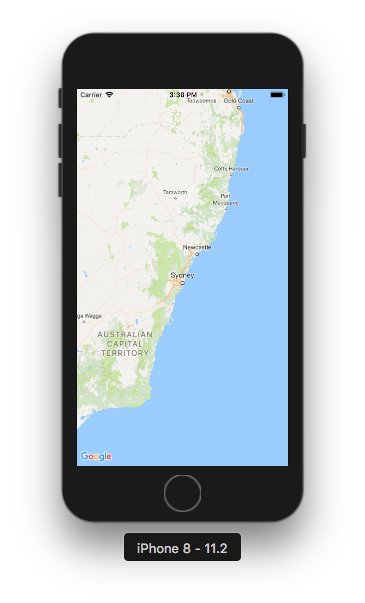
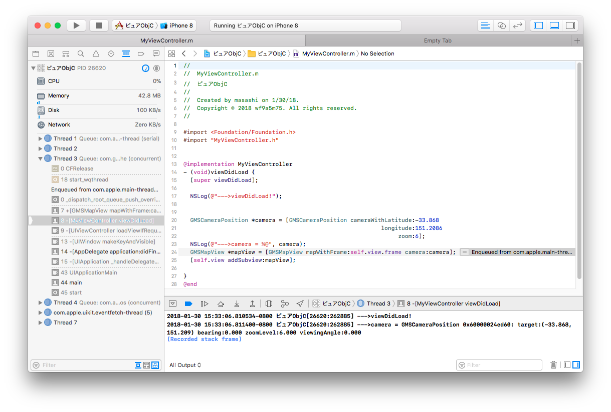

# Bug 72484863 examples
  [GMSMapView mapWithFrame: camera:] crashes if CFBundleExecutable is non-English
  https://issuetracker.google.com/issues/72484863

## Overview

There are two project that are contain the same Obj-C code.

  - pureObjC
    This is an example that display the Google Maps safely.

  - ピュアObjC
    The word `ピュア` means `pure` in Japanese (non-English character).

  If application contains `non-English character` (like `ピュアObjC` example), the Google Maps SDK for iOS crashes 100%.

## Environment

  - installed Google Maps SDK version: 2.5.0

  - XCode : Version 9.2 (9C40b)

## Reproduce ways:

  1. Open the `pureObjC/pureObjC.xcodeproj` file with Xcode, then run it.
     You should see a map without error.

     

  2. As the same as step 1, Open the `ピュアObjC/ピュアObjC.xcodeproj` file, then run it.
     You will get the error.

     
     
